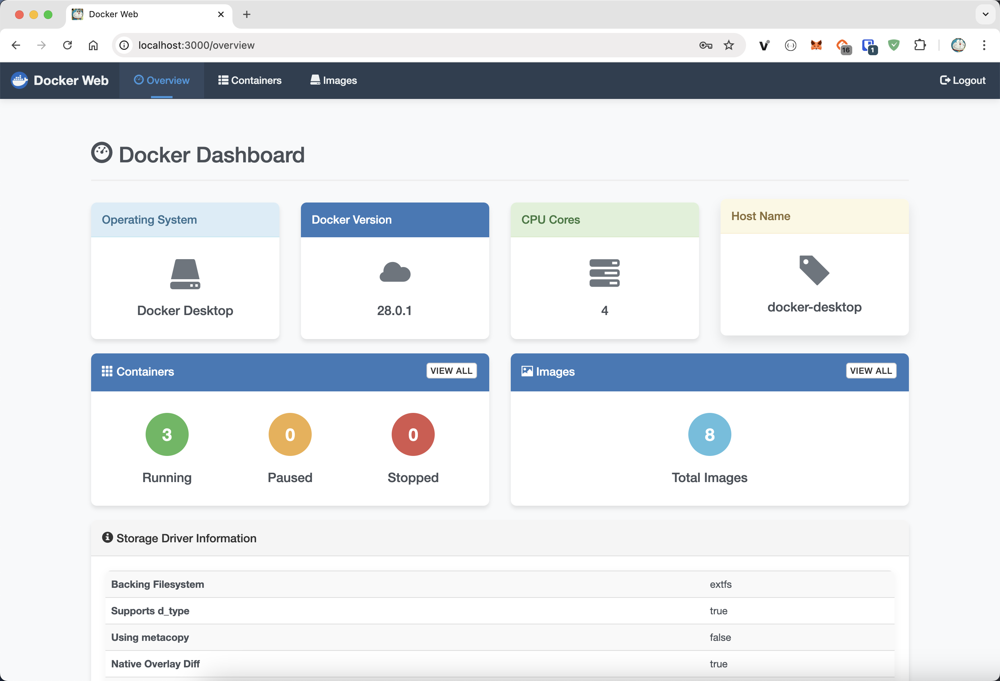
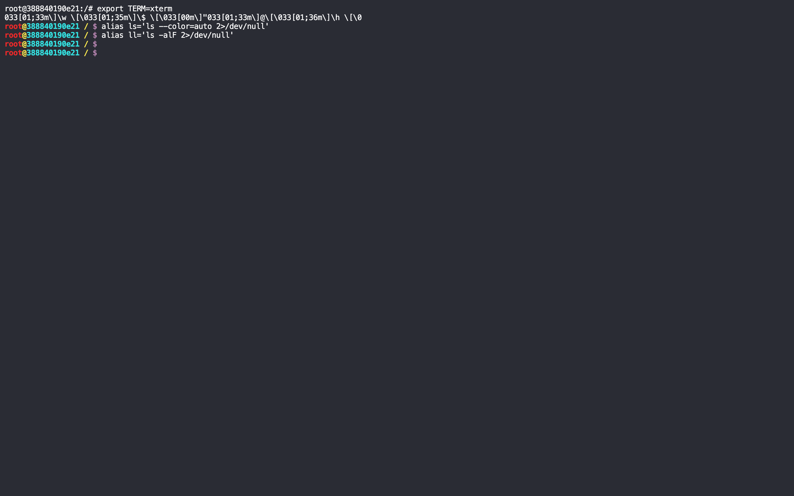
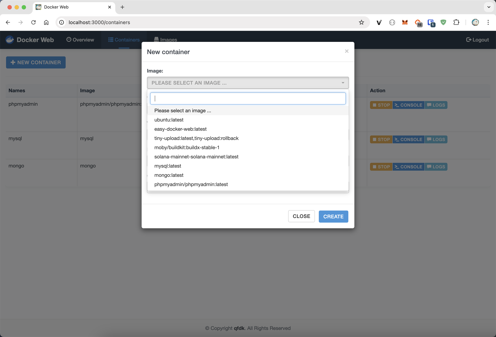
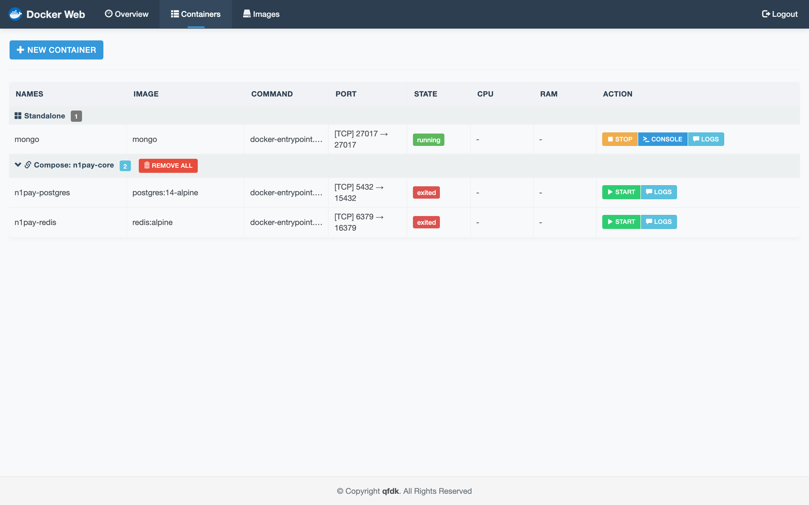
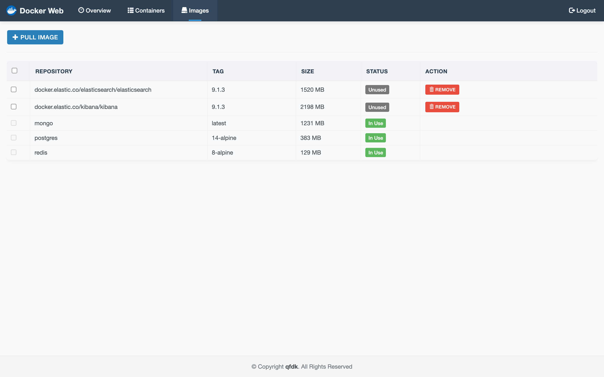
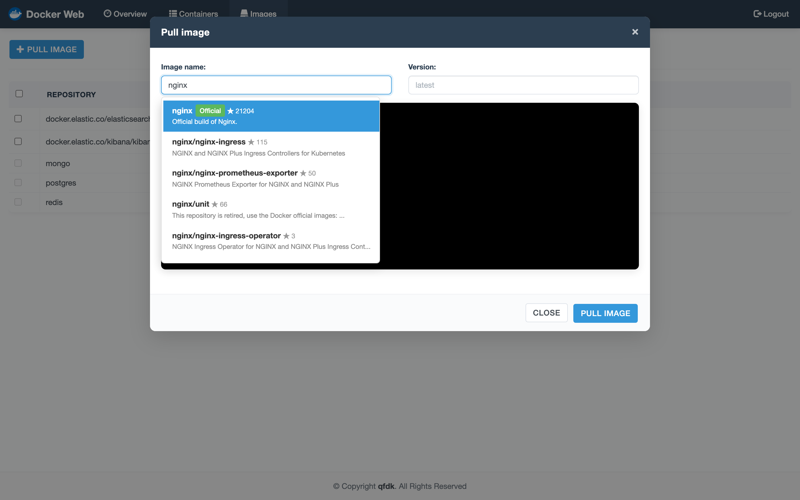
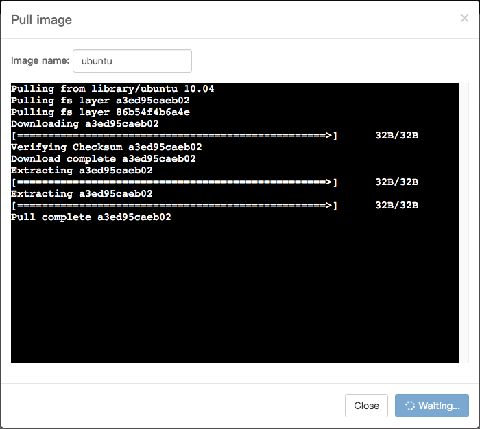

# EasyDockerWeb

A simple Web Ui for Docker using `xterm.js`, `Node.js` and `Socket.io`

- if you need docker cluster pls use [https://portainer.io/](https://portainer.io/)
- autocomplete image name

## Quick start

```bash
docker run -it -d -p 3000:3000 -v /var/run/docker.sock:/var/run/docker.sock qfdk/easydockerweb
```

[http://localhost:3000](http://localhost:3000) enjoy ;)

## Requirement

- Node.js
- Docker remote api >= v1.24
- macOs or Linux or windows

## Developement mode

```bash
git clone https://github.com/qfdk/EasyDockerWeb.git
cd EasyDockerWeb
npm i 
npm start
```

## TODO

Refactoring by using react.js

## 中文

简单的 docker 管理程序，使用了express socket.io 来实现前后端通讯，代码有待优化。
功能有待提升。

- 计划使用react重构。

## Build your owen docker image

```bash
docker build -t easy-docker-web .
docker run -p 3000:3000 -v /var/run/docker.sock:/var/run/docker.sock easy-docker-web
```
## Images














