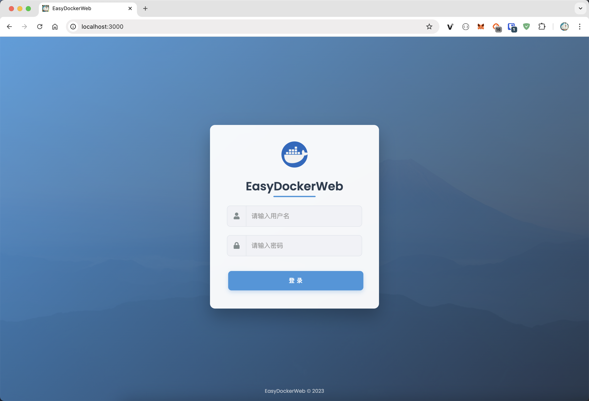

# EasyDockerWeb

A simple Web Ui for Docker using `xterm.js`, `Node.js` and `Socket.io`

- if you need to use docker cluster, [https://portainer.io/](https://portainer.io/) may be a good choice.
- search image by name
- terminal
- log

## Quick start

Set EDW_USERNAME and EDW_PASSWORD to overwrite the default username and password.

*PS:* Default username and password are **admin/admin.**

```bash
docker run -it -d -p 3000:3000 -e EDW_USERNAME='admin' -e EDW_PASSWORD='admin' -v /var/run/docker.sock:/var/run/docker.sock qfdk/easydockerweb
```

[http://localhost:3000](http://localhost:3000) enjoy ;)

## Requirement

- Node.js
- Docker remote api >= v1.24
- macOS or Linux or windows

## Development mode

```bash
git clone https://github.com/qfdk/EasyDockerWeb.git
cd EasyDockerWeb
npm i 
npm start
```

## Build your owen docker image

```bash
git clone https://github.com/qfdk/EasyDockerWeb.git
cd EasyDockerWeb
docker build -t easy-docker-web .
docker run -p 3000:3000 -v /var/run/docker.sock:/var/run/docker.sock easy-docker-web
```

## 中文

简单的 docker 管理程序，使用了express socket.io 来实现前后端通讯，代码有待优化。
功能有待提升。

- 计划使用react重构 https://github.com/qfdk/EasyDockerWeb/tree/react

## Images



## Sponsor
<a href="https://www.jetbrains.com/?from=EasyDockerWeb"></a>

## React.js web ui (beta)

```bash
cd web-ui
yarn install
yarn start
```
[http://localhost:4000](http://localhost:4000)

We have a todo list now.

## TODO
Refactoring by using react.js https://github.com/qfdk/EasyDockerWeb/tree/react
